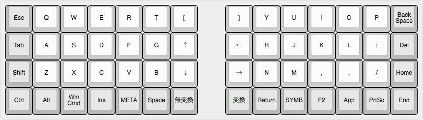
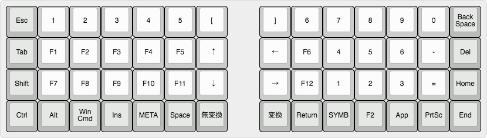
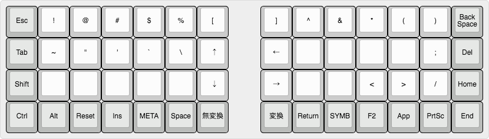

# My Ergo42 Tawol keymap

## BASE layer



## META layer



## SYMB layer



## script

Used [Keyboad Layout Editor](http://www.keyboard-layout-editor.com/#/) to draw images.

```
/* BASE */
[{c:"#babcba",a:7},"Esc",{c:"#cccccc"},"Q","W","E","R","T","[",{x:1},"]","Y","U","I","O","P",{c:"#babcba"},"Back Space"],
["Tab",{c:"#cccccc"},"A","S","D","F","G","&uarr;",{x:1},"&larr;","H","J","K","L",";",{c:"#babcba"},"Del"],
["Shift",{c:"#cccccc"},"Z","X","C","V","B","&darr;",{x:1},"&rarr;","N","M",",",".","/",{c:"#babcba"},"Home"],
["Ctrl","Alt","Win Cmd","Ins","META","Space","無変換",{x:1},"変換","Return","SYMB","F2","App","PrtSc","End"]

/* META */
[{c:"#babcba",a:7},"Esc",{c:"#cccccc"},"1","2","3","4","5","[",{x:1},"]","6","7","8","9","0",{c:"#babcba"},"Back Space"],
["Tab",{c:"#cccccc"},"F1","F2","F3","F4","F5","&uarr;",{x:1},"&larr;","F6","4","5","6","-",{c:"#babcba"},"Del"],
["Shift",{c:"#cccccc"},"F7","F8","F9","F10","F11","&darr;",{x:1},"&rarr;","F12","1","2","3","=",{c:"#babcba"},"Home"],
["Ctrl","Alt","Win Cmd","Ins","META","Space","無変換",{x:1},"変換","Return","SYMB","F2","App","PrtSc","End"]

/* SYMB */
[{c:"#babcba",a:7},"Esc",{c:"#cccccc"},"!","@","#","$","%","[",{x:1},"]","^","&","*","(",")",{c:"#babcba"},"Back Space"],
["Tab",{c:"#cccccc"},"~","\"","'","`","\\","&uarr;",{x:1},"&larr;","","","","",";",{c:"#babcba"},"Del"],
["Shift",{c:"#cccccc"},"","","","","","&darr;",{x:1},"&rarr;","","","<",">","/",{c:"#babcba"},"Home"],
["Ctrl","Alt","Reset","Ins","META","Space","無変換",{x:1},"変換","Return","SYMB","F2","App","PrtSc","End"]
```
